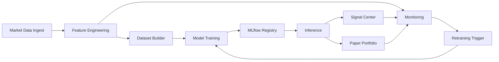

# AlgoTrade Sentinel

AlgoTrade Sentinel is an end-to-end trading research and MLOps platform built with FastAPI, Next.js, SQLAlchemy, MLflow, Prefect, and Docker. It covers the full loop from market data ingestion to feature engineering, model training, backtesting, signal generation, monitoring, paper portfolio simulation, and deployment.

Screenshot / demo placeholder:
- See [docs/screenshots/README.md](docs/screenshots/README.md) for the current placeholder and expected assets.

## Architecture



## Tech Stack

| Layer | Tools |
| --- | --- |
| Frontend | Next.js 14, TypeScript, Tailwind CSS, Recharts |
| Backend | FastAPI, SQLAlchemy, Pydantic, Alembic |
| ML / MLOps | pandas, scikit-learn, Optuna, MLflow, Prefect, Evidently |
| Data | SQLite for local dev, PostgreSQL for deployment |
| Runtime | Docker, Docker Compose, APScheduler, optional slowapi |
| Hosting | Vercel, Render, Supabase |

## Quick Start

```bash
cp .env.example .env
make dev
make migrate
make seed
python -m pytest backend/tests -q
```

Main URLs:
- Frontend: `http://localhost:3000`
- Backend API: `http://localhost:8000`
- Swagger: `http://localhost:8000/docs`
- ReDoc: `http://localhost:8000/redoc`
- MLflow: `http://localhost:5000`
- Prefect: `http://localhost:4200`

## Full Setup

1. Install prerequisites: Docker, Node.js 20+, Python 3.11+, and GNU Make.
2. Copy `.env.example` to `.env` and set any non-default values.
3. Start the stack with `make dev` for Docker or run frontend/backend locally if preferred.
4. Run migrations with `make migrate`.
5. Seed data with `make seed` or run `scripts/demo_setup.sh` for the full demo bootstrap.
6. Open the Dashboard at `http://localhost:3000`.

## Environment Variables

| Variable | Purpose |
| --- | --- |
| `ENVIRONMENT` | Runtime mode: development, staging, production |
| `DATABASE_URL` | SQLAlchemy database connection string |
| `SECRET_KEY` | Backend secret for production use |
| `FRONTEND_URL` | Allowed frontend origin for backend CORS |
| `NEXT_PUBLIC_API_URL` | Public backend base URL used by Next.js |
| `MLFLOW_TRACKING_URI` | MLflow tracking server or local store |
| `PREFECT_API_URL` | Prefect server URL |
| `RATE_LIMIT_DEFAULT` | Default request rate limit |
| `INGEST_CRON` | Scheduler cron for market ingest |
| `FEATURE_CRON` | Scheduler cron for feature generation |
| `INFERENCE_CRON` | Scheduler cron for inference |
| `MONITORING_CRON` | Scheduler cron for monitoring |

See `.env.example` and `.env.production.example` for the full documented list.

## API Reference

Full endpoint documentation lives in [docs/api-reference.md](docs/api-reference.md). Key route groups:

| Group | Representative Endpoints |
| --- | --- |
| Market | `GET /api/market/tickers`, `GET /api/market/ohlcv/{ticker}`, `POST /api/market/ingest` |
| Features | `GET /api/features/list/{ticker}`, `GET /api/features/stats/{ticker}`, `GET /api/dataset/versions` |
| Training / Registry | `POST /api/training/run`, `GET /api/experiments/list`, `GET /api/registry/models` |
| Backtesting | `POST /api/backtest/run`, `GET /api/backtest/runs`, `GET /api/backtest/{run_id}` |
| Signals | `POST /api/signals/run`, `GET /api/signals/latest`, `GET /api/signals/history/{ticker}` |
| Monitoring | `GET /api/monitoring/latest`, `GET /api/monitoring/drift/features`, `POST /api/monitoring/retrain` |
| Portfolio | `GET /api/portfolio/summary`, `GET /api/portfolio/orders`, `GET /api/portfolio/pnl` |
| Alerts / Watchlist | `GET /api/alerts/`, `POST /api/alerts/read-all`, `POST /api/watchlist/add` |
| System / Settings | `GET /api/system/status`, `GET /api/settings`, `POST /api/settings` |

## Phase Overview

| Phase | Outcome |
| --- | --- |
| 1 | Market data foundation and backend scaffolding |
| 2 | Research UI and market exploration |
| 3 | Strategy Lab and feature visibility |
| 4 | Training Lab and experiment tracking |
| 5 | Backtesting Center and metrics |
| 6 | Signal Center and model registry workflows |
| 7 | Monitoring, drift detection, and retraining |
| 8 | Paper portfolio, alerts engine, and watchlist management |
| 9 | Dockerization, deployment, and CI/CD |
| 10 | Real dashboard, UI polish, docs, tests, and demo prep |

## Documentation Map

- [docs/architecture.md](docs/architecture.md)
- [docs/api-reference.md](docs/api-reference.md)
- [docs/ml-pipeline.md](docs/ml-pipeline.md)
- [docs/deployment/local_docker.md](docs/deployment/local_docker.md)
- [docs/deployment/vercel.md](docs/deployment/vercel.md)
- [docs/deployment/render.md](docs/deployment/render.md)
- [docs/deployment/supabase.md](docs/deployment/supabase.md)
- [DEMO.md](DEMO.md)

## Development Workflow

Useful commands:

```bash
make dev
make prod
make migrate
make seed
make test
make lint
make build
```

Validation commands used in Phase 10:

```bash
npm --prefix frontend run lint
npm --prefix frontend run type-check
python -m pytest backend/tests -q
python -m compileall backend/app ml mlops
```

## Contributing

1. Create a feature branch.
2. Run tests and lint locally before opening a PR.
3. Keep backend changes covered with pytest where practical.
4. Document any new env vars, flows, or endpoints in the relevant docs file.
5. Do not remove user data or reset unrelated workspace changes.
