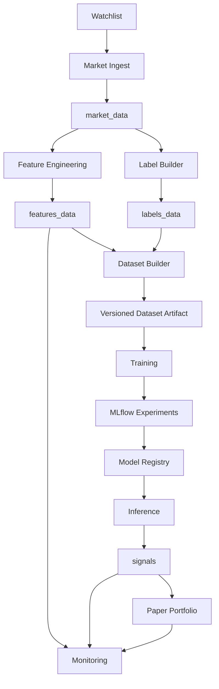
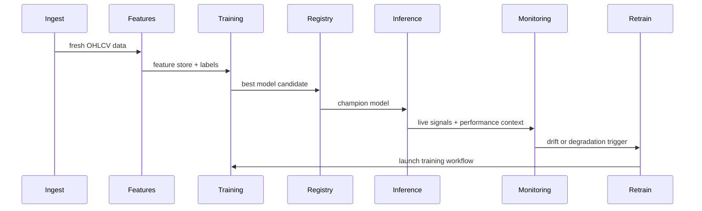

# Architecture

## System Overview

AlgoTrade Sentinel is organized as a full-stack monorepo with three main layers:

- `frontend/`: Next.js application for research, ML operations, trading, monitoring, and admin workflows.
- `backend/`: FastAPI application exposing market, features, training, registry, backtesting, signals, monitoring, portfolio, alerts, settings, and system APIs.
- `ml/` and `mlops/`: feature engineering, labeling, training, inference, monitoring, portfolio simulation, and Prefect flows.

## Data Flow

## MLOps Lifecycle

## Runtime Components

- Frontend serves all pages and fetches backend APIs through environment-aware URL resolution.
- Backend applies request logging, security headers, gzip compression, optional rate limiting, and scheduler startup.
- APScheduler provides a lightweight fallback when Prefect is unavailable.
- Docker Compose runs frontend, backend, PostgreSQL, MLflow, and Prefect together.

## Database Schema Overview

Core tables:

- `market_data`: OHLCV history per ticker and date.
- `features_data`: engineered indicators for each ticker/date.
- `labels_data`: forward return labels used for supervised training.
- `dataset_versions`: versioned training dataset metadata.
- `signals`: live or fallback BUY / SELL / HOLD predictions.
- `model_registry_log`: promotion and archive audit trail.
- `backtest_results`: metrics and serialized equity / trade history.
- `monitoring_reports`: daily drift and performance summaries.
- `retrain_log`: retraining trigger history and promotion outcome.
- `watchlist`: active ticker universe.
- `positions`, `orders`, `portfolio_snapshots`: paper portfolio state.
- `alerts`: alert inbox for portfolio and operations events.
- `app_settings`: persisted admin and simulation settings.

## Frontend Information Architecture

- `/`: executive dashboard with portfolio, signals, monitoring, and pipelines.
- `/market-explorer`, `/strategy-lab`: research and feature inspection.
- `/training-lab`, `/model-registry`: ML experiment and promotion workflows.
- `/backtesting`, `/signal-center`, `/paper-portfolio`: trading workflows.
- `/monitoring-center`, `/admin-settings`, `/help-docs`: operations, configuration, and documentation.
